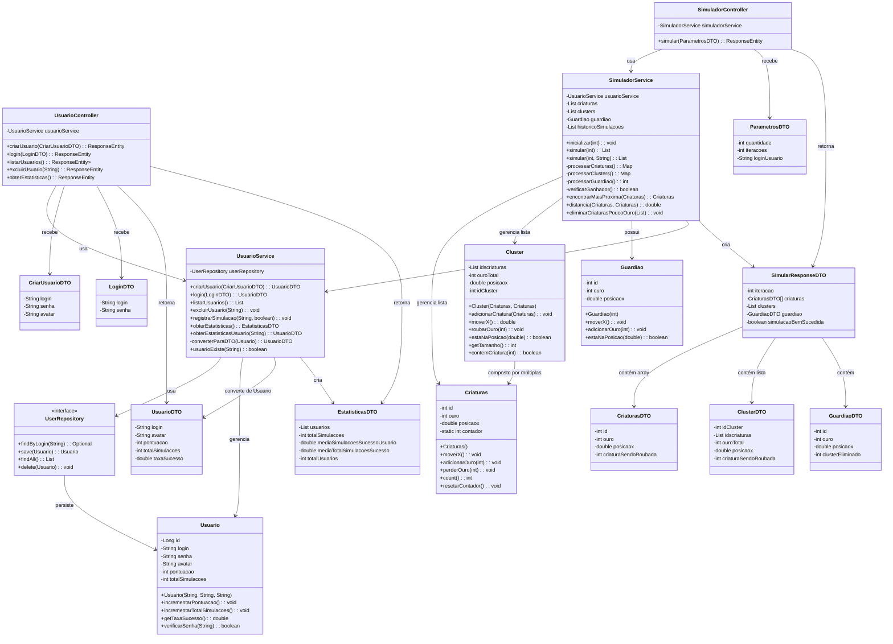

# Diagrama de Classes - Sistema Saltitantes

Este diagrama representa a arquitetura da aplicação Saltitantes, focando nas funcionalidades de simulação e usuário.

## Descrição do Sistema

O sistema **Saltitantes** é uma aplicação Spring Boot que simula criaturas que se movem em um horizonte, formam clusters e interagem com um guardião. Os usuários podem executar simulações e acompanhar estatísticas.

## Arquitetura

- **Controllers**: Camada de apresentação (API REST)
- **Services**: Camada de negócio com lógica da aplicação
- **Entities**: Camada de modelo/domínio
- **Repository**: Camada de persistência
- **DTOs**: Objetos de transferência de dados

## Funcionalidades Principais

### Simulação

- **Inicialização**: Cria criaturas e guardião
- **Movimento**: Criaturas se movem no horizonte baseado em seu ouro
- **Formação de Clusters**: Criaturas próximas se agrupam
- **Eliminação**: Guardião elimina clusters próximos
- **Condições de Vitória**: Simulação termina quando resta apenas guardião ou guardião + 1 criatura

### Gestão de Usuários

- **Cadastro e Login**: Sistema de autenticação simples
- **Estatísticas**: Acompanhamento de simulações bem-sucedidas
- **Ranking**: Taxa de sucesso por usuário

## Patterns Utilizados

- **MVC**: Separação clara entre Controller, Service e Model
- **DTO Pattern**: Objetos para transferência de dados
- **Repository Pattern**: Abstração da camada de persistência
- **Dependency Injection**: Através do Spring Framework
